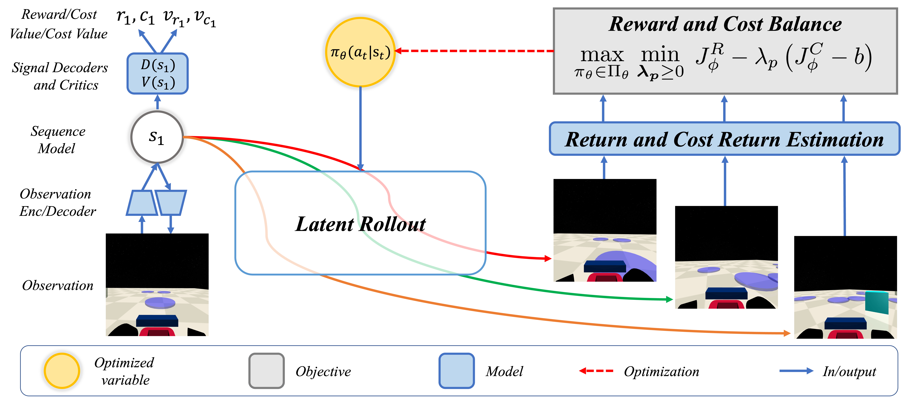
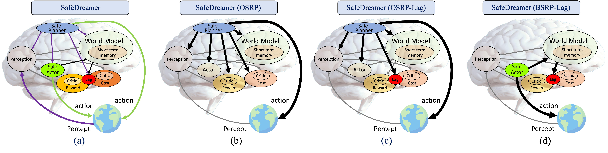

<br>
<p align="center">
<h1 align="center"><strong>SafeDreamer: Safe Reinforcement Learning with World Models
</strong></h1>
  <p align="center">
    <a href='https://github.com/hdadong/' target='_blank'>Weidong Huang*</a>&emsp;
    <a href='https://jijiaming.com/' target='_blank'>Jiaming Ji*</a>&emsp;
    <a href='https://github.com/muchvo' target='_blank'>Borong Zhang</a>&emsp;
    <a href='https://scholar.google.com/citations?hl=zh-CN&user=f1BzjccAAAAJ' target='_blank'>Chunhe Xia</a>&emsp;
    <a href='https://www.yangyaodong.com/' target='_blank'>Yaodong Yang</a>&emsp;
    <br>
    Beihang University&emsp;Peking University
  </p>
</p>

<p align="center">
  <a href="https://arxiv.org/abs/2307.07176" target='_blank'>
    
  </a>
  <a href="https://sites.google.com/view/safedreamer" target='_blank'>
    
  </a>
</p>


## 🏠 About
<!--  -->
<div style="text-align: center;">
    
</div>
The deployment of Reinforcement Learning (RL) in real-world applications is constrained by its failure to satisfy safety criteria. Existing Safe Reinforcement Learning (SafeRL) methods, which rely on cost functions to enforce safety, often fail to achieve zero-cost performance in complex scenarios, especially vision-only tasks. These limitations are primarily due to model inaccuracies and inadequate sample efficiency. The integration of world models has proven effective in mitigating these shortcomings. In this work, we introduce SafeDreamer, a novel algorithm incorporating Lagrangian-based methods into world model planning processes within the superior Dreamer framework. Our method achieves nearly zero-cost performance on various tasks, spanning low-dimensional and vision-only input, within the Safety-Gymnasium benchmark, showcasing its efficacy in balancing performance and safety in RL tasks. 

## 🔥 News
- [2024-01] SafeDreamer has been accepted for ICLR 2024. 

## 🔍 Overview

### Framework
<p align="center">
  
</p>
The Architecture of SafeDreamer. (a) illustrates all components of SafeDreamer, which distinguishes costs as safety indicators from rewards and balances them using the Lagrangian method and a safe planner. The OSRP (b) and OSRP-Lag (c) variants execute online safety-reward planning (OSRP) within the world models for action generation. OSRP-Lag integrates online planning with the Lagrangian approach to balance long-term rewards and costs. The BSRP-Lag variant of SafeDreamer (d) employs background safety-reward planning (BSRP) via the Lagrangian method within the world models to update a safe actor. 


## 🔗 Citation

If you find our work helpful, please cite:

```bibtex
@article{safedreamer,
      title={SafeDreamer: Safe Reinforcement Learning with World Models}, 
      author={Weidong Huang and Jiaming Ji and Borong Zhang and Chunhe Xia and Yaodong Yang},
      journal={arXiv preprint arXiv:2307.07176},
      year={2023},
}
```

## 📄 License
SafeDreamer is released under Apache License 2.0.


## 👏 Acknowledgements
- [DreamerV3](https://github.com/danijar/dreamerv3): Our codebase is built upon DreamerV3.
